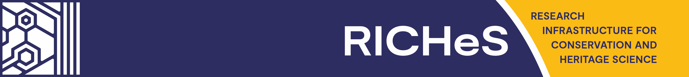
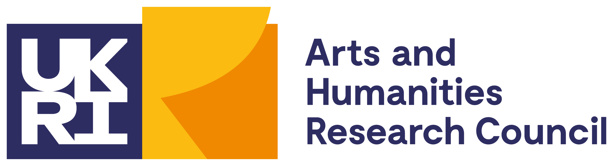

  

# Welcome to the RICHeS GitHub Organisation

This GitHub organisation hosts code, documentation, and other digital outputs associated with the **RICHeS – Research Infrastructure for Conservation and Heritage Science** programme.

[RICHeS](https://www.riches.ukri.org/) is a national initiative funded by [UKRI](https://www.ukri.org/) through the [Arts and Humanities Research Council (AHRC)](https://www.ukri.org/councils/ahrc/). It aims to strengthen the UK’s capability in conservation and heritage science by creating a sustainable, coordinated research infrastructure that supports interdisciplinary collaboration, access to specialist facilities and expertise, and the development of best practices across the heritage sector.

  

---

## About this Organisation

This GitHub space supports the technical and collaborative activities of the RICHeS programme. It is used to:

- Share and maintain code and scripts from RICHeS-funded projects
- Host documentation, metadata schemas, and data models
- Coordinate collaborative development across work packages and partner institutions
- Support community engagement through transparent development and access to research tools

This environment promotes the principles of [FAIR data](https://www.go-fair.org/fair-principles/) and [open research](https://www.ukri.org/manage-your-award/publishing-your-research/open-research/), encouraging accessible, interoperable, and reusable outputs.

## Getting Involved

If you are involved in a RICHeS-funded project or a collaborating institution, you are welcome to contribute. Please contact one of the organisation administrators for access or guidance on participation.

If you're new to GitHub or need help getting started, you may find these resources useful:

- [Introduction to GitHub](https://docs.github.com/en/get-started)
- [Creating a GitHub Account](https://github.com/signup)
- [About GitHub Organisations](https://docs.github.com/en/organizations/collaborating-with-groups-in-your-organization/about-organizations)

---

For more information about the RICHeS programme, please visit the official website:  
👉 [**www.riches.ukri.org**](https://www.riches.ukri.org/)
